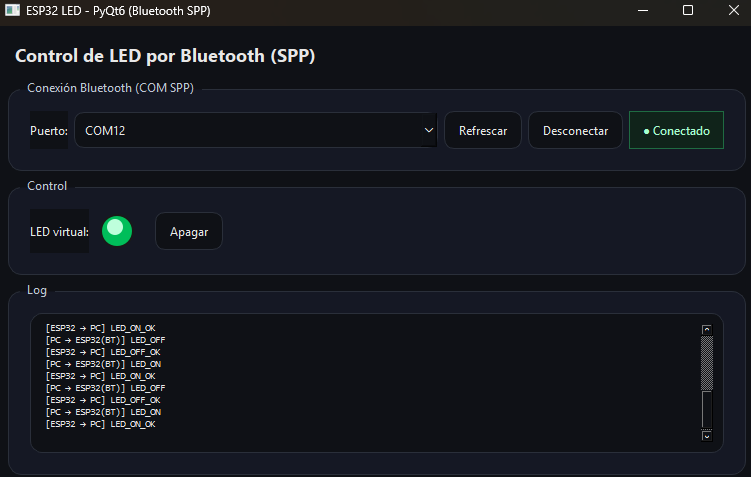
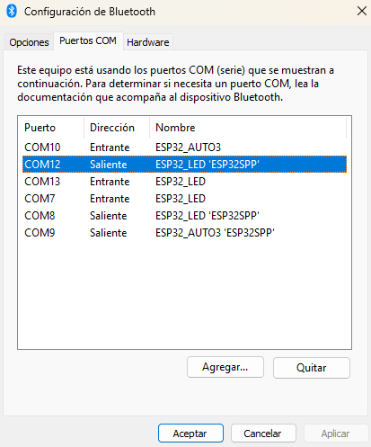
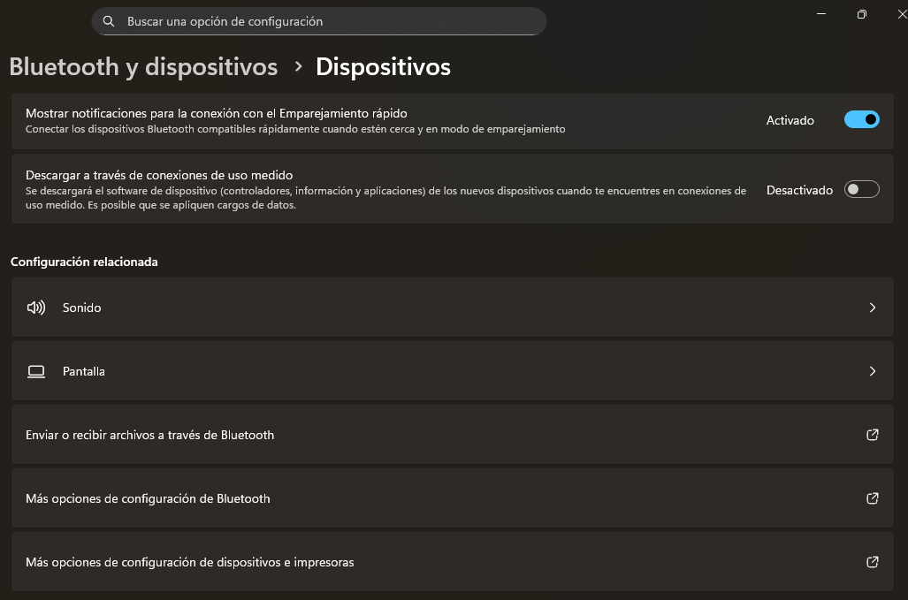

# Interfaz de Usuario (Python USB / Bluetooth)

En esta práctica se desarrolló un sistema ciberfísico que integra una interfaz gráfica implementada en PyQt6 con un microcontrolador ESP32 mediante comunicación Bluetooth Serial Port Profile (SPP). El objetivo principal fue permitir el control de un actuador físico (LED del ESP32) desde una aplicación de escritorio, manteniendo sincronización entre el estado físico del sistema y su representación digital.

Esta práctica demuestra la interacción entre software de alto nivel y hardware embebido mediante un canal de comunicación inalámbrico, destacando conceptos fundamentales como comunicación serial virtual, programación orientada a eventos y retroalimentación del sistema.

---

## 2. Instalación y Configuración del Entorno

El primer paso consistió en instalar la librería PyQt6 mediante:

```bash
pip install PyQt6
````

Esta librería provee los componentes necesarios para crear interfaces gráficas en Python utilizando el framework Qt. Sin esta instalación no sería posible desarrollar la GUI requerida para interactuar con el ESP32.

Posteriormente se verificó la instalación con:

```bash
pip show PyQt6
```

Esta verificación permite confirmar que los módulos fueron correctamente instalados y evita errores de importación durante la ejecución del programa.

---

## 3. Diseño de la Interfaz Gráfica

La interfaz gráfica fue desarrollada en Visual Studio Code utilizando PyQt6. Se optó por esta herramienta debido a su robustez, soporte multiplataforma y modelo basado en eventos, el cual es ideal para aplicaciones que interactúan con hardware en tiempo real.

La GUI se organizó en tres bloques funcionales:

1. Gestión de conexión Bluetooth.
2. Control del LED.
3. Registro de comunicación.

Esta separación modular permite claridad en la interacción y facilita el mantenimiento del código.


*Figura 1:* Pantalla inicial de configuración en el software KiCAD.

La interfaz incluye un LED virtual implementado con `QPainter`, el cual refleja visualmente el estado del LED físico del ESP32. Esto mejora la interacción humano-máquina y permite validar visualmente la comunicación.

---

## 4. Comunicación Serial sobre Bluetooth

El ESP32 utiliza Bluetooth clásico con perfil SPP, el cual crea un puerto serial virtual en el sistema operativo. Esto permite que la comunicación se maneje como si fuera UART tradicional.

Para interactuar con este puerto se utilizó la librería PySerial:

```python
serial.Serial(port, 115200, timeout=0.1)
```

Aunque Bluetooth no depende del baudrate físico, PySerial requiere este parámetro para configurar la conexión. Se utiliza un timeout corto para evitar bloqueos en la lectura.

La selección del puerto COM correcto es fundamental, ya que el sistema operativo crea dos:

* COM entrante
* COM saliente

Solo el COM saliente permite iniciar comunicación desde la PC.


*Figura 1:* Pantalla inicial de configuración en el software KiCAD.


*Figura 1:* Pantalla inicial de configuración en el software KiCAD.

---

## 5. Programación del ESP32

El ESP32 fue programado mediante Arduino IDE utilizando la librería BluetoothSerial.

```cpp
#include "BluetoothSerial.h"
BluetoothSerial SerialBT;
```

Se inicializa el dispositivo con:

```cpp
SerialBT.begin("ESP32_LED");
```

Esto permite que la computadora detecte el dispositivo durante el emparejamiento.

El LED se configura como salida digital:

```cpp
pinMode(LED_PIN, OUTPUT);
```

El ESP32 interpreta comandos de texto enviados desde la GUI:

```cpp
if (cmd == "LED_ON") {
 digitalWrite(LED_PIN, HIGH);
 SerialBT.println("LED_ON_OK");
}
```

La confirmación enviada de regreso es crucial para garantizar sincronización.

---

## 6. Arquitectura del Sistema

El sistema implementado sigue un modelo ciberfísico donde:

* La GUI representa el sistema digital.
* El ESP32 representa el sistema físico.
* Bluetooth actúa como canal de comunicación.

```
Usuario → GUI → Bluetooth → ESP32 → LED
                        ↑
                        Confirmación
```

Este flujo asegura coherencia entre ambos dominios.

---

## 7. Funcionamiento del Código PyQt6

El programa sigue un modelo orientado a eventos:

### Lectura No Bloqueante

Se utiliza `QTimer` para consultar periódicamente el puerto serial sin bloquear la interfaz. Esto es necesario porque las GUIs deben permanecer responsivas.

### Confirmación de Estados

La GUI no cambia el LED virtual hasta recibir confirmación del ESP32. Esto evita inconsistencias si ocurre pérdida de datos.

### Manejo de Eventos

Los botones generan eventos que envían comandos al microcontrolador.

---

## 8. Resultados

El sistema logró establecer comunicación bidireccional estable entre la interfaz gráfica y el ESP32. El control del LED físico se realiza en tiempo real y el LED virtual refleja correctamente el estado del hardware.

La implementación demostró:

* Comunicación inalámbrica funcional.
* Sincronización correcta.
* Interfaz responsiva.
* Confirmación confiable.
* Integración hardware-software.

---

## 9. Errores y Debugging

Durante el desarrollo se identificaron varios problemas:

### Selección incorrecta del puerto

Se resolvió identificando el puerto COM saliente.

### Bloqueo de la interfaz

Se solucionó usando QTimer para lectura no bloqueante.

### Falta de sincronización

Se resolvió implementando confirmaciones.

### Problemas de emparejamiento

Se solucionaron reiniciando dispositivos y repitiendo vinculación.

Estos errores permitieron comprender mejor el comportamiento del sistema.

---

## 10. Discusión Técnica

El sistema demuestra que Bluetooth SPP permite implementar comunicación serial virtual sin necesidad de hardware adicional. La confirmación de comandos introduce robustez y la programación orientada a eventos garantiza responsividad.

Este enfoque es aplicable a IoT y automatización.

---

## 11. Conclusión

Se desarrolló exitosamente un sistema ciberfísico que integra una interfaz gráfica con un microcontrolador mediante Bluetooth. La práctica permitió comprender la importancia de la sincronización, la comunicación serial y la programación orientada a eventos.

El sistema representa un modelo escalable para aplicaciones reales.

---