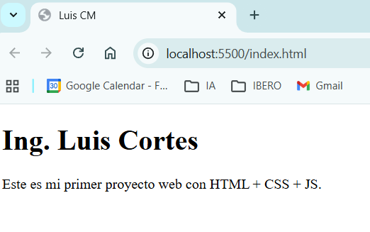
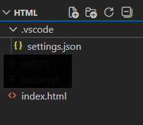
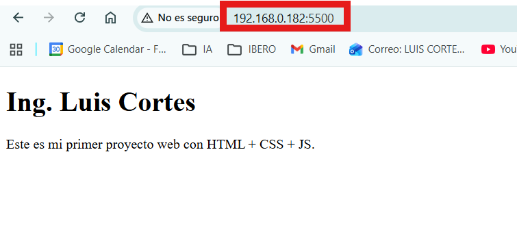
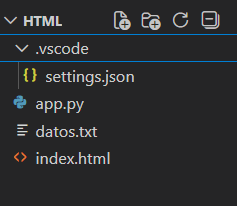
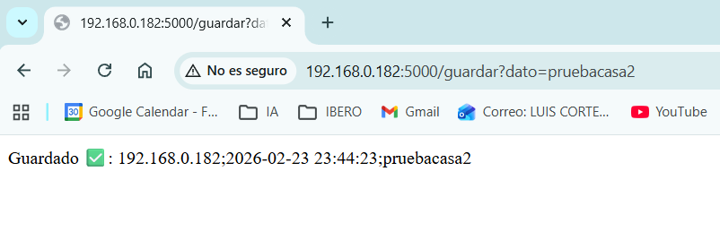
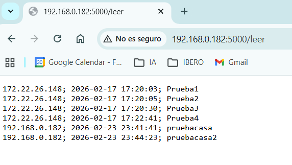

# Práctica 1: Página Web y API

## 1) Creación de la página (index.html)

Al momento de elaborar la página web, el primer paso es crear un archivo index.html, el cual funcionará como la portada del sitio. En la sección 1.1 se muestra el código utilizado. Ahí puedes ir construyendo la estructura básica de la página, agregando el encabezado <head> (título) y el cuerpo <body> (contenido visible como textos, imágenes y secciones).

### 1.1 Código index.html

```html
<!doctype html>
<html>
<head>
    <title>Luis CM</title>
</head>
<body>
    <h1>Ing. Luis Cortes</h1>
    <p>Este es mi primer proyecto web con HTML + CSS + JS.</p>
</body>
</html>
```

## 2) Visualización local con Live Server

Posteriormente, se recomienda trabajar en Visual Studio Code (escritorio) e instalar la extensión Live Server, la cual permite visualizar la página en un servidor local (localhost) y actualizarla automáticamente al guardar cambios. Una vez instalada la extensión, abre el archivo index.html, haz clic derecho y selecciona “Open with Live Server”. Si todo está configurado correctamente, se mostrará una pantalla como la presentada en la Figura 1.



*Figura 1: Visualización de la página web en localhost mediante la extensión Live Server en Visual Studio Code.*

En la Figura 1 se observa que, en la parte superior del navegador, la pestaña muestra el título Luis CM, y en la página se visualiza el contenido definido dentro del <body> del archivo index.html.


## 3) Configuración para acceso desde otros dispositivos (settings.json)

Como se observa en la Figura 1, la URL muestra localhost:5500 porque la página se está ejecutando de forma local mediante Live Server. Para poder acceder desde cualquier dispositivo utilizando la IP del equipo servidor, se debe crear un archivo settings.json y copiar el código mostrado en la sección 3.2. Con esta configuración, Live Server permitirá abrir el sitio usando la IP del equipo en lugar de únicamente localhost.

Es importante escribir el código con la sintaxis correcta. Además, el puerto puede configurarse con cualquiera de los valores comunes, como 5000, 5500, entre otros.

### 3.1 Estructura de carpetas

Es fundamental mantener la estructura de carpetas como se muestra en la Figura 2: crear una carpeta llamada .vscode donde se guardará el archivo settings.json, y dejar el archivo index.html fuera de esa carpeta, en el directorio principal del proyecto.



*Figura 2: Estructura de carpetas del proyecto (carpeta .vscode y archivo index.html).*

### 3.2 Código settings.json
```json
{
    "liveServer.settings.port":5500,
    "liveServer.settings.host":"localhost"
}
```

### 3.3 Obtención de la IP del equipo para acceder desde otros dispositivos

Una vez completados los pasos anteriores, se debe identificar la dirección IP del equipo que está funcionando como servidor. Para ello, abre la terminal del dispositivo, con Windows + R, escribe cmd y presiona Enter. En la terminal, ejecuta el comando ipconfig y presiona Enter.

Se mostrarán varias líneas, pero la más importante es “Dirección IPv4”, ya que esa es la IP que permitirá abrir la página desde otro dispositivo conectado a la misma red. En el ejemplo, la IP es 192.168.0.182.

Finalmente, para acceder a la página desde otro dispositivo, se utiliza la siguiente sintaxis:
192.168.0.182:5500, donde 5500 es el puerto definido previamente en el archivo settings.json. Si todo está configurado correctamente, se visualizará la misma página, pero con la diferencia de que la URL mostrará la IP del equipo, como se indica en el recuadro rojo de la Figura 3.



*Figura 3: Acceso a la página mediante IP y puerto desde otro dispositivo*

## 4) Creación de una aplicación web con Flask

A continuación, se crea una aplicación web básica con Flask que permite guardar y leer datos desde un archivo de texto llamado datos.txt. La ruta /guardar?dato=... recibe un parámetro dato, obtiene la IP del cliente (considerando X-Forwarded-For si existe) y la fecha/hora actual, y guarda todo en una sola línea con formato separado por ;. Por otro lado, la ruta /leer abre el archivo y regresa todo su contenido como texto plano. Finalmente, la app se ejecuta con host="0.0.0.0" para que sea accesible desde otros dispositivos en la red y en el puerto 5500. El código correspondiente se muestra en la sección 4.2.

La estructura de carpetas debe organizarse como se muestra en la Figura 4. Tanto el archivo app.py como el archivo de texto datos.txt deben colocarse en la carpeta principal del proyecto (fuera de .vscode) si se desea que el programa guarde y lea el archivo de texto en la misma ubicación utilizada en el paso anterior.



*Figura 4: Estructura del proyecto: archivos app.py y datos.txt en el directorio principal*

**Nota:** En el código si el puerto configurado no funciona, prueba con otro. En este caso, se intentó primero con **5500** sin éxito y posteriormente con **5000**, el cual funcionó correctamente.


### 4.2) app.py

```python
# Step 1: Imports
from flask import Flask, request
from datetime import datetime

# Step 2: Create app
app = Flask(__name__)

# Step 3: File name
FILE_NAME = "datos.txt"

# Step 4: Get client IP
def get_ip():
    forwarded = request.headers.get("X-Forwarded-For", "")
    if forwarded:
        return forwarded.split(",")[0].strip()
    return request.remote_addr or "unknown"

# Step 5: Append one line to txt (CSV style)
def append_line(line):
    with open(FILE_NAME, "a", encoding="utf-8") as f:
        f.write(line + "\n")

# Step 6: Read full txt
def read_lines():
    try:
        with open(FILE_NAME, "r", encoding="utf-8") as f:
            return f.read()
    except FileNotFoundError:
        return ""

# Step 7: Save by URL: /guardar?dato=hola
@app.get("/guardar")
def guardar():
    # Step 7.1: Read query param
    dato = (request.args.get("dato") or "").strip()
    if dato == "":
        return "Error: usa /guardar?dato=algo", 400

    # Step 7.2: Build fields
    ip = get_ip()
    hora = datetime.now().strftime("%Y-%m-%d %H:%M:%S")

    # Step 7.3: Save as one line: dato,ip,hora
    append_line(f"{ip}; {hora}; {dato}")

    return f"Guardado ✅: {ip};{hora};{dato}", 200

# Step 8: Read: /leer
@app.get("/leer")
def leer():
    text = read_lines()
    return text, 200, {"Content-Type": "text/plain; charset=utf-8"}

# Step 9: Run
if __name__ == "__main__":
    app.run(host="0.0.0.0", port=5000, debug=True)
```

## 5) Registro y consulta de datos desde el navegador

A continuación se muestra cómo utilizar las rutas del sistema para guardar y leer información en el archivo de texto.
La URL http://192.168.0.182:5000/guardar?dato=pruebacasa realiza una petición GET al servidor que está corriendo en la IP 192.168.0.182 y en el puerto 5000 (definido al ejecutar Flask). La ruta /guardar activa la función guardar() del programa y el parámetro dato=pruebacasa (lo que va después de ?) es el valor que se quiere registrar, al entrar a esa ruta, el servidor toma ese dato, obtiene la IP del cliente y la hora, y lo guarda como una nueva línea en datos.txt. En la Figura 5 se observa el proceso de guardado, donde el dato se registra siguiendo la estructura definida en el paso anterior.



*Figura 5: Ejemplo de guardado de un dato mediante la ruta /guardar*

En cambio, http://192.168.0.182:5000/leer llama la ruta /leer, que ejecuta la función leer() y simplemente lee el contenido completo del archivo datos.txt para mostrarlo en el navegador como texto plano. En la Figura 6 se presenta la lectura del archivo y su contenido, lo cual permite visualizar de forma clara toda la información almacenada.



*Figura 6: Visualización del contenido del archivo datos.txt al acceder a la ruta /leer*