# Práctica 3: Deploy

## 1) Servidor Flask Local

### 1.1) Desarrollo inicial del servidor Flask en entorno local
El primer paso consiste en crear y organizar todos los archivos de código que se utilizarán para ejecutar el servidor Flask de forma local. Esto permite validar que las rutas, las solicitudes (GET/POST) y la lógica general funcionen correctamente antes de desplegar el servicio en la nube (por ejemplo, en Render). En la Figura 1 se muestra la estructura correcta de los archivos y carpetas que se explicarán a continuación.

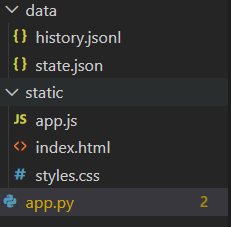

*Figura 1: Estructura de carpetas y archivos del proyecto (backend en Flask y frontend en static) utilizada para el control de la tira de LEDs.*

### 1.2) Servidor Flask local para control de LEDs
Este programa crea un servidor Flask local que sirve la página web desde la carpeta static y expone una API para controlar el estado de la tira LED. El estado (color en formato #RRGGBB, cantidad de LEDs encendidos, rev y updated_at) se guarda en data/state.json para que no se pierda al reiniciar. Para evitar archivos corruptos, usa atomic_write() que escribe primero en un archivo temporal y luego lo reemplaza de forma segura. La ruta GET /api/state devuelve el estado actual y POST /api/state lo actualiza validando que el color y el rango de LEDs sean correctos. Finalmente, corre en 0.0.0.0:5500 para que puedas acceder desde el celular o el ESP32 en la misma red. El archivo app.py se presenta a continuación y está disponible para su descarga.

###  Descargar
[Descargar código Python (app.py)]({{ site.baseurl }}/assets/files/app.py)

### 1.3) Frontend del panel de control (HTML, CSS y JavaScript) servido desde la carpeta static
Estos archivos corresponden al frontend que Flask sirve desde la carpeta static. 

- **`index.html`**: Define la estructura del panel de control (título, botones y selector de color) que se muestra en el navegador.

- **`styles.css`**: Se encarga del diseño visual, como colores de fondo, tamaños, espaciado, estilo de botones y el área de mensajes, para que la interfaz sea clara y fácil de usar.

- **`app.js`**: contiene la lógica: detecta los clics en All ON / All OFF y en cada LED, guarda el estado seleccionado y envía solicitudes HTTP (POST) a los endpoints de Flask para actualizar el color y qué LEDs deben encenderse, además, puede mandar automáticamente los cambios cuando el usuario modifica el color, logrando una respuesta más inmediata en la tira.

A continuación se presenta la carpeta con los archivos previamente explicados (.html, .css y .js), listos para su descarga.

###  Descargar
[Descargar códigos Frontend]({{site.baseurl }}/assets/files/static.zip)

### 1.4)  Backend del sistema: estado actual (state.json) e historial de cambios (history.jsonl)
La carpeta data se utiliza para persistir información del sistema, es decir, para que no se pierda cuando el servidor Flask se reinicia. 

- **`state.json`**: Guarda el estado actual que debe aplicar el ESP32, como el color seleccionado, cuántos LEDs deben estar encendidos (o el arreglo de LEDs, según tu versión), el contador de cambios (rev) y la marca de tiempo (updated_at). 

- **`history.jsonl`**: Funciona como un registro histórico en formato “JSON por línea”, donde cada actualización puede guardarse como un evento independiente (por ejemplo: fecha/hora, IP del usuario, color y acción), lo que permite auditar cambios, depurar errores y analizar cómo se ha utilizado el panel a lo largo del tiempo. 

A continuación, se encuentra disponible para descarga la carpeta con los archivos JSON y JSONL.

###  Descargar
[Descargar códigos Backend]({{site.baseurl }}/assets/files/state.zip)

### 1.5)  Configuración del ESP32 en Arduino para sincronización con Flask y control de la tira WS2812 vía Wi-Fi

El último paso antes de obtener los resultados consiste en programar el ESP32 en Arduino para que se conecte a la red Wi-Fi y consulte al servidor Flask el estado más reciente de la tira LED. En este código, lo más importante es configurar correctamente las credenciales de red (WIFI_SSID y WIFI_PASS) y la dirección del servidor donde corre Flask, es decir, la IP de la compu y se puede vualizar con ipconfig en la terminal y el puerto (SERVER_PORT, en este caso 5500). Una vez conectado, el ESP32 realiza una solicitud periódica a la ruta /api/state, recibe un JSON con el color (#RRGGBB), la cantidad de LEDs a encender (count) y un contador de cambios (rev). 

Con esta información, el microcontrolador convierte el color hexadecimal a valores RGB, actualiza los primeros count LEDs de la tira WS2812 (apagando el resto) y únicamente aplica cambios cuando detecta un rev nuevo, evitando actualizaciones innecesarias. De esta forma, el hardware queda sincronizado con el panel web y refleja en tiempo real los comandos enviados al backend. 

A continuación se encuentra disponible el código en Arduino para programar el ESP32 y controlar el encendido de la tira de LEDs.

###  Descargar
[Descargar código Arduino (localFlask.ino)]({{ site.baseurl }}/assets/files/localFlask.ino)

### 1.6) Ejecución local del servidor y acceso a la interfaz web
Para finalizar, después de cargar el código en el ESP32, se debe ejecutar el servidor Flask desde Visual Studio Code (corriendo el archivo app.py). Una vez iniciado, el servidor mostrará en consola la dirección donde está disponible el panel web. En este caso, la página se abre desde el navegador ingresando la siguiente URL: http://172.22.26.170:5500. Desde ahí podrás usar la interfaz para enviar comandos y ver reflejados los cambios en la tira de LEDs. Los resultados se muestran en el video: 

### Video
<video controls width="720">
  <source src="{{ '/assets/videos/videoLocalFlask.mp4' | relative_url }}" type="video/mp4">
  Tu navegador no soporta video HTML5.
</video>

## 2) Servidor Flask + Servidor Front (Html)

### 2.1) Arquitectura general del sistema

El sistema desarrollado consiste en una arquitectura distribuida basada en un modelo cliente–servidor diseñado para el control remoto de una tira LED WS2812 mediante un microcontrolador ESP32 y una interfaz web. A diferencia de implementaciones locales donde todos los componentes se ejecutan en una sola máquina, en esta solución el frontend, el backend y el dispositivo físico operan como nodos independientes dentro de la misma red.

La arquitectura se compone de tres elementos principales:

* **Frontend (PC B)** → interfaz de usuario
* **Backend Flask (PC A)** → servidor y API
* **ESP32** → dispositivo actuador
* **WS2812** → sistema físico controlado

El flujo operativo del sistema puede describirse como:

Frontend → HTTP → Flask → JSON → ESP32 → LEDs

Esta separación permite simular un entorno IoT real donde múltiples clientes pueden interactuar con un servidor central que administra el estado del sistema y distribuye comandos hacia dispositivos físicos.

---

### 2.2) Desarrollo del backend con Flask

El backend fue implementado utilizando el framework Flask en Python, el cual proporciona una plataforma ligera para construir APIs REST. El servidor actúa como intermediario entre la interfaz web y el hardware, almacenando el estado del sistema y exponiendo endpoints accesibles desde cualquier dispositivo de la red.

El servidor se inicializa mediante:

```python
from flask import Flask, request, jsonify
from flask_cors import CORS

app = Flask(__name__)
CORS(app)
```

La activación de **CORS** resulta fundamental en esta arquitectura, ya que permite que el frontend, ejecutándose en otra computadora, pueda realizar solicitudes HTTP sin restricciones de seguridad del navegador.

El backend define dos endpoints principales:

### Endpoint de lectura del estado

```python
@app.get("/api/state")
def get_state():
    return jsonify(load_state())
```

Este endpoint permite que cualquier cliente consulte el estado actual del sistema, el cual incluye:

* color en formato hexadecimal
* número de LEDs activos
* contador de revisiones
* marca temporal

---

### Endpoint de actualización del sistema

```python
@app.post("/api/state")
def set_state():
    data = request.get_json()
    color = data.get("color")
    count = data.get("count")
    return jsonify(save_state(color, count))
```

Este método procesa las solicitudes enviadas por el frontend, valida los datos recibidos y actualiza el estado persistente del sistema.

---

### 2.3) Persistencia del estado y sincronización

Una característica esencial del backend es la persistencia del estado mediante el archivo:

```
data/state.json
```

Este archivo actúa como una memoria compartida entre el servidor y el ESP32, permitiendo que el sistema mantenga su configuración incluso después de reinicios. La estructura del estado incluye:

```
{
 "color":"#ee00ff",
 "count":4,
 "rev":116,
 "updated_at":"2026-02-25T17:38:10"
}
```

El campo `rev` cumple una función crítica en la sincronización, ya que permite detectar cambios reales y evitar actualizaciones redundantes en el dispositivo físico.

---

### 2.4) Ejecución del servidor Flask

El servidor se ejecuta utilizando el comando:

```bash
python app.py
```

y se configura para aceptar conexiones externas mediante:

```python
app.run(host="0.0.0.0", port=5000)
```

El uso de `0.0.0.0` permite que el backend sea accesible desde cualquier dispositivo en la red local, incluyendo la PC B y el ESP32.

---

### 2.5) Desarrollo del frontend web

El frontend fue desarrollado empleando tecnologías web estándar:

* HTML para la estructura
* CSS para el diseño
* JavaScript para la lógica

La interfaz proporciona un panel de control interactivo que permite modificar el color y la cantidad de LEDs encendidos en tiempo real.

El elemento principal de control se implementa mediante:

```javascript
const BACKEND_BASE = "http://IP_PC_A:5000";
```

Este parámetro establece la conexión directa con el backend Flask, permitiendo que todas las acciones del usuario se traduzcan en solicitudes HTTP.

---

### Envío automático de comandos

El frontend detecta cambios en la interfaz utilizando eventos:

```javascript
colorPicker.addEventListener("input", sendState)
countRange.addEventListener("input", sendState)
```

Cuando el usuario modifica el color o el número de LEDs, se ejecuta una solicitud POST:

```javascript
fetch(`${BACKEND_BASE}/api/state`,{
 method:"POST",
 headers:{"Content-Type":"application/json"},
 body:JSON.stringify({color,count})
})
```

Esto permite una interacción inmediata y elimina la necesidad de botones manuales, logrando un control fluido en tiempo real.

En la Figura 2 se muestra la ejecución del servidor HTTP local que permite servir los archivos del frontend.

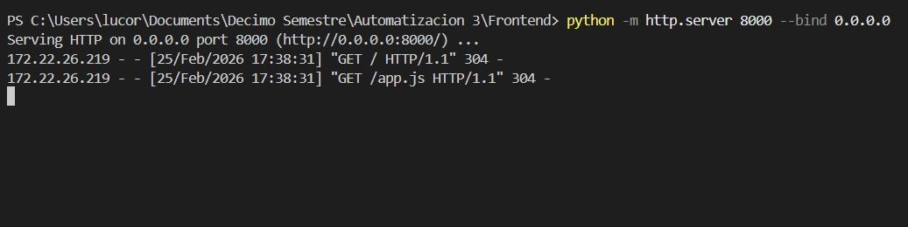

*Figura 2: Ejecución del servidor HTTP en la PC B mediante el comando python -m http.server 8000 --bind 0.0.0.0.*

---

### 2.6) Comunicación entre frontend y backend

La comunicación entre el frontend y el backend se basa en el protocolo HTTP utilizando JSON como formato de intercambio de datos. Esta estrategia presenta múltiples ventajas:

* independencia de plataforma
* simplicidad de integración
* escalabilidad
* compatibilidad con IoT

El backend actúa como un punto centralizado de control que puede recibir comandos desde múltiples clientes simultáneamente.

En la Figura 3 se muestra la interfaz gráfica del sistema en funcionamiento.

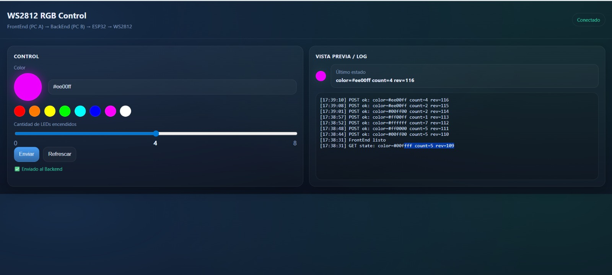

*Figura 3: Interfaz del panel web ejecutándose en la PC B, mostrando el control del color, cantidad de LEDs y el registro de comunicación con el backend.*

---
## Descargar

[Descargar código Python (app_seconf.py)]({{ site.baseurl }}/assets/files/app_seconf.py)

[Descargar código CSS (styles.css)]({{ site.baseurl }}/assets/files/styles.css)

[Descargar código HTML (index (2).html)]({{ site.baseurl }}/assets/files/index (2).html)

[Descargar código JSON (app (2).js)]({{ site.baseurl }}/assets/files/app (2).js)
### 2.7) Programación del ESP32 y control de la tira WS2812

El ESP32 fue programado en el entorno Arduino para actuar como cliente del servidor Flask y como controlador directo de la tira LED WS2812.

El dispositivo establece conexión Wi-Fi mediante:

```cpp
WiFi.begin(WIFI_SSID, WIFI_PASS);
```

Posteriormente, consulta periódicamente el estado del sistema utilizando solicitudes HTTP:

```cpp
HTTPClient http;
http.begin("http://IP_PC_A:5000/api/state");
int code = http.GET();
```

---

## Descargar

[Descargar código Arduino (Practica4Auto3.ino)]({{ site.baseurl }}/assets/files/Practica4Auto3.ino)

### Recepción y procesamiento del JSON

El ESP32 recibe un JSON que contiene el estado del sistema:

```
{"color":"#ee00ff","count":4,"rev":116}
```

Este se procesa mediante:

```cpp
DynamicJsonDocument doc(512);
deserializeJson(doc,http.getString());
```

---

### Conversión de color y control físico

El color hexadecimal se convierte a valores RGB y se aplica a la tira LED:

```cpp
uint32_t c = strip.Color(r,g,b);
for(int i=0;i<count;i++){
 strip.setPixelColor(i,c);
}
strip.show();
```

Este proceso permite que la tira LED refleje inmediatamente los cambios realizados desde la interfaz web.

---

### 2.8) Sincronización inteligente mediante revisión (rev)

El uso del parámetro `rev` permite que el ESP32 solo actualice el sistema cuando detecta un cambio real en el estado, lo que reduce:

* tráfico de red
* consumo energético
* latencia
* procesamiento innecesario

Este mecanismo es fundamental en sistemas IoT donde múltiples dispositivos pueden interactuar simultáneamente con un servidor central.

---

### 2.9) Integración completa del sistema

La integración final del sistema demuestra una arquitectura IoT funcional en la que el usuario puede controlar un dispositivo físico a través de una interfaz web distribuida. La separación entre frontend, backend y hardware no solo mejora la modularidad del sistema, sino que también permite escalar la solución a entornos más complejos donde múltiples dispositivos y usuarios interactúan simultáneamente.

El sistema implementado representa un ejemplo claro de interacción entre software, redes y hardware, destacando principios fundamentales de sistemas ciberfísicos y computación distribuida.

### Video del funcionamiento
<video controls width="720"> <source src="{{ '/assets/videos/Frontend_Backend2pc.mp4' | relative_url }}" type="video/mp4"> Tu navegador no soporta video HTML5. </video>

## 3) Docker Flask (Servidor Render)

### 3.1) Repositorio 1: Frontend para la interfaz gráfica (GitHub Pages)

Primero, como ya se explicó, los archivos del frontend se encargan de construir la interfaz gráfica y la interacción del usuario. Para ello, se crea un repositorio en GitHub que incluya `index.html`, `styles.css` y `app.js`. Tal como se mencionó en el Ejercicio 1, estos archivos definen la estructura de la página, su diseño visual y la lógica de los botones/acciones del panel de control. A continuación se presenta la carpeta con todos los archivos que debe contener el **Repositorio 1**, lista para su descarga y uso.

### Frontend: Carpeta con los archivos HTML + CSS + JS

[Descargar códigos Frontend]({{site.baseurl }}/assets/files/tiraLeds.zip)

### 3.2) Publicación del frontend en GitHub Pages

Posteriormente, se debe generar la liga pública del sitio utilizando GitHub Pages. Para ello, dentro del repositorio se selecciona el ícono de engrane Settings (parte superior) y, en el menú lateral izquierda, se ingresa a la sección Pages. Ahí se configura el despliegue seleccionando la rama Main y la carpeta Root, y finalmente se guarda la configuración, tal como se muestra en la Figura 4. Después, se regresa a la página principal del repositorio y, en el apartado About (lado derecho), se presiona el engrane para habilitar la opción “Use your GitHub Pages website”. Con esto, la liga del sitio web queda disponible para acceder a la interfaz de control desde el navegador.

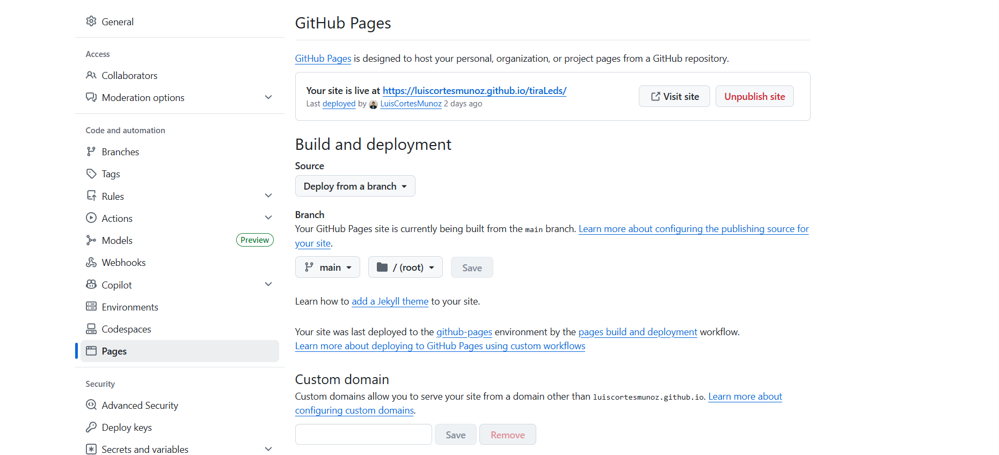

*Figura 4: Configuración de GitHub Pages: selección de la rama Main y carpeta Root para publicar la interfaz web del proyecto.*

### 3.4) Repositorio 2: Backend en Flask con Docker para despliegue en Render

Después de completar los pasos anteriores, se crea un segundo repositorio en GitHub que contendrá toda la parte del proyecto que será desplegada en Render. Este repositorio incluye el servidor Flask (app.py), donde se definen las rutas de la API que reciben y entregan el estado de los LEDs, así como los archivos necesarios para empaquetar y ejecutar la aplicación en un contenedor

- **`.dockerignore`**: Indica qué archivos o carpetas deben excluirse al construir la imagen Docker. Esto reduce el tamaño del despliegue y evita subir contenido innecesario.

- **`Dockerfile`**: Define paso a paso cómo crear la imagen del servidor en Docker: qué versión de Python usar, cómo instalar dependencias y cómo ejecutar la aplicación en Render (normalmente con `gunicorn`).

- **`requirements.txt`**: Lista las librerías de Python que necesita el proyecto (por ejemplo `Flask`, `flask-cors`, `gunicorn`). Render/Docker las instala automáticamente durante el build.

- **`README.md`**: Documento general del repositorio con una descripción del proyecto, estructura, endpoints y uso básico (pruebas locales y propósito del backend).

- **`README_RENDER.md`**: Guía específica para el despliegue en Render: configuración del servicio, variables de entorno, comandos y rutas para verificar que el backend quedó funcionando.

A continuación, se incluye la carpeta en formato .zip con todos los archivos necesarios para este repositorio, lista para descargar y utilizar.

### Backend: Carpeta con los archivos de Docker Flask

[Descargar códigos Backend]({{site.baseurl }}/assets/files/led-git-front-flask-back-docker--main.zip)

### 3.5) Creación de cuenta en Render y vinculación con GitHub

A continuación se describe la configuración inicial en Render. Primero, si aún no se cuenta con una cuenta, es necesario crearla. Para ello, se selecciona la opción “Get Started” en la esquina superior derecha, lo que redirige a la pantalla mostrada en la Figura 5. Es importante registrarse o iniciar sesión utilizando GitHub, ya que esto permite vincular la cuenta y seleccionar el repositorio creado en el paso 3.4 para realizar el despliegue del backend.

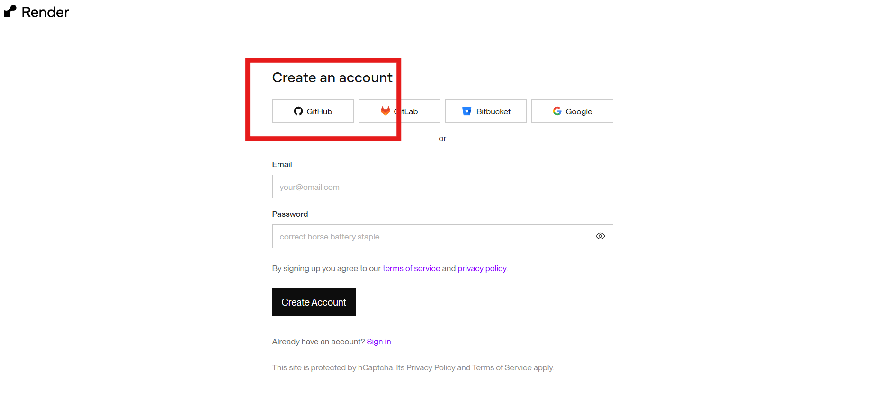

*Figura 5: Pantalla de inicio de Render para crear una cuenta mediante GitHub y poder vincular el repositorio del proyecto.*

### 3.6) Creación de un Web Service en Render y selección del repositorio

Posteriormente, una vez iniciada la sesión en Render, se debe seleccionar la opción New y luego Web Service, tal como se muestra en la Figura 6. 

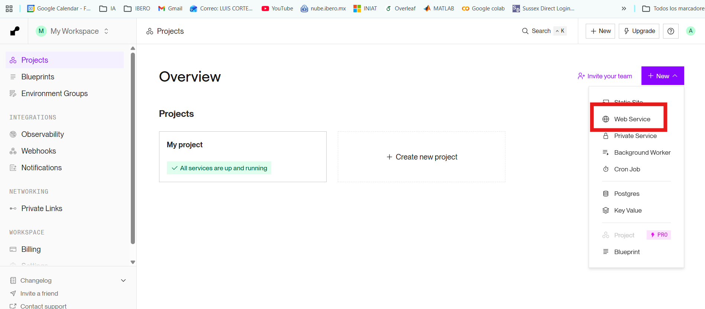

*Figura 6: Menú de Render para crear un nuevo servicio seleccionando New → Web Service.*

Esta acción redirige a la pantalla presentada en la Figura 7, donde se debe elegir el repositorio previamente creado y explicado en el paso 3.4, el cual contiene los archivos necesarios para desplegar el backend.

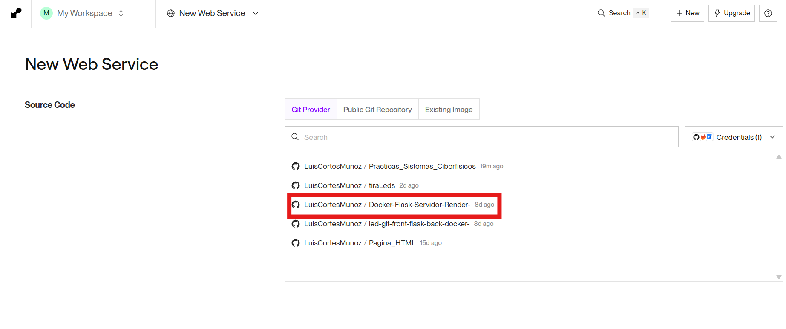

*Figura 7: Pantalla de Render para seleccionar el repositorio de GitHub que se desplegará como Web Service (paso 3.4).*

### 3.7) Configuración del Web Service en Render y despliegue con Docker

Como se observa en la Figura 8, el siguiente paso es configurar el Web Service en Render. Es fundamental verificar que se haya seleccionado el repositorio correcto. Posteriormente, en la opción de Runtime/Language se debe elegir Docker, confirmar que la rama sea Main, y en Instance Type seleccionar el plan gratuito. Una vez completada esta configuración, se desciende al final de la página y se presiona el botón Deploy Web Service para iniciar el despliegue del servidor.

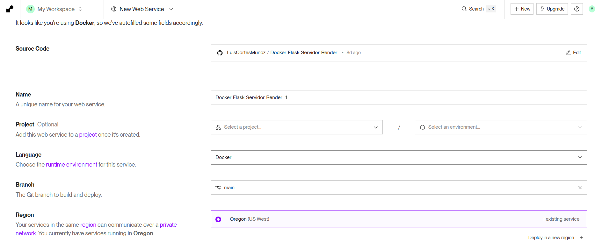

*Figura 8: Configuración del Web Service en Render: selección del repositorio, runtime Docker, rama Main y plan Free, previo al despliegue.*


### 3.8) Despliegue de Render

Finalmente, si todo está correctamente configurado y se siguieron los pasos anteriores, aparecerá un mensaje como el que se muestra en la Figura 9 indicando que el servicio está Live y que la aplicación ya se encuentra disponible en su URL principal. Esto confirma que el despliegue se realizó de forma exitosa y que el servidor Flask está corriendo correctamente en Render. Es importante guardar ese enlace, ya que se utilizará en los siguientes pasos para conectarlo con el frontend y para que el ESP32 consulte el estado de los LEDs mediante las rutas de la API.

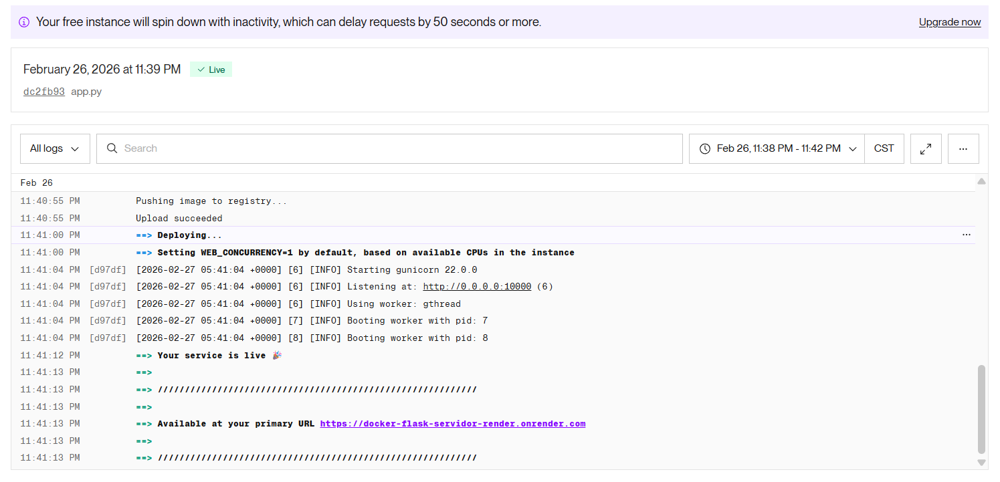

*Figura 9: Confirmación de despliegue exitoso en Render: el servicio aparece como Live y se muestra la URL pública del backend, la cual se usará en los pasos posteriores.*


### 3.9) Reactivar el servicio en Render

Debido a que se está utilizando el plan gratuito de Render, el servicio puede detenerse automáticamente tras un periodo de inactividad. Por ello, si se cierra Render o el servidor deja de responder, es necesario volver a desplegarlo. Para hacerlo, se ingresa a la cuenta de Render, se selecciona el proyecto creado y se accede al repositorio correspondiente. Posteriormente, aparecerá una pantalla como la mostrada en la Figura 10, donde se debe presionar Deploy latest commit para reactivar el servicio con la versión más reciente del código.

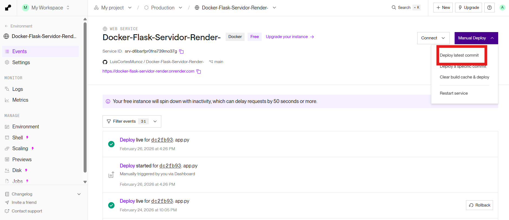

*Figura 10: Panel del servicio en Render para reactivar el despliegue seleccionando Deploy latest commit en el plan gratuito.*

### 3.10) Actualización de enlaces en Arduino y app.js para usar Render

Finalmente, el código de Arduino y el archivo app.js mantienen la misma lógica descrita en los pasos anteriores, sin embargo, la diferencia principal es que ahora se debe utilizar la URL pública de Render obtenida en el paso 3.8 en ambos casos. Esto permite que el frontend envíe las solicitudes al servidor desplegado y que el ESP32 consulte el estado de los LEDs desde la nube. A continuación se muestran los fragmentos de código donde se realiza estos cambios.

```javascript
const API_BASE = "https://docker-flask-servidor-render.onrender.com";
```

```arduino
// Render base (sin /api/...)
const char* RENDER_BASE = "https://docker-flask-servidor-render.onrender.com";

// Endpoint que SÍ existe en tu Render
const char* STATE_PATH = "/api/state_leds";
```

Código disponible para descargar del programa en Arduino, ya con la modificación aplicada.

###  Descargar
[Descargar código Arduino (tiraLedRender.ino)]({{ site.baseurl }}/assets/files/tiraLedRender.ino)

### 3.11) Resultados

Finalmente, para realizar el cambio de color y el control de la tira LED, se debe ingresar a la liga de GitHub Pages creada en el paso 3.2. Al abrirla, se mostrará una interfaz similar a la de la Figura 11, desde la cual es posible seleccionar el color con el que se iluminará la tira, encender o apagar LEDs individuales según su posición y utilizar las opciones All ON y All OFF para activar o desactivar todos los LEDs de manera inmediata.

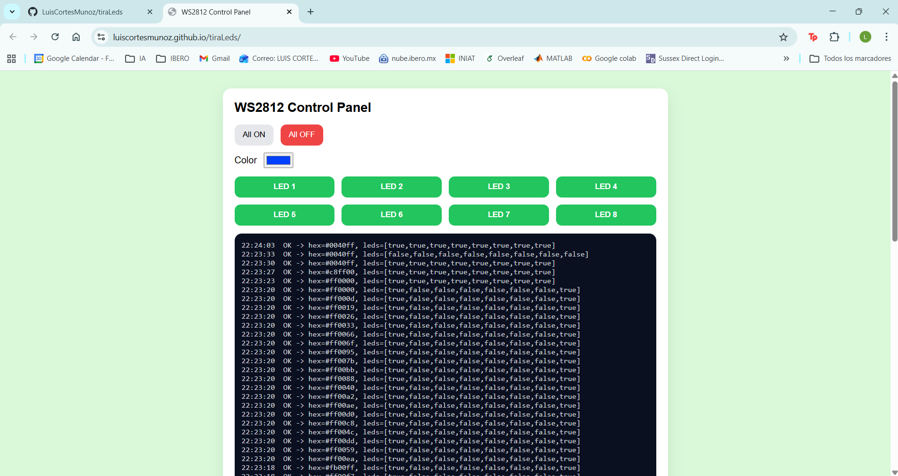

*Figura 11: Interfaz del panel de control en GitHub Pages para seleccionar color y encender/apagar LEDs individuales o todos a la vez.*

 Cada cambio realizado en la interfaz se envía al backend (Docker + Flask en Render), donde el estado queda almacenado. Además, como se muestra en la Figura 12, es posible monitorear el último estado registrado accediendo al enlace del servidor seguido de /api/state_leds, lo que permite visualizar el color seleccionado y el patrón/cantidad de LEDs encendidos en ese momento.

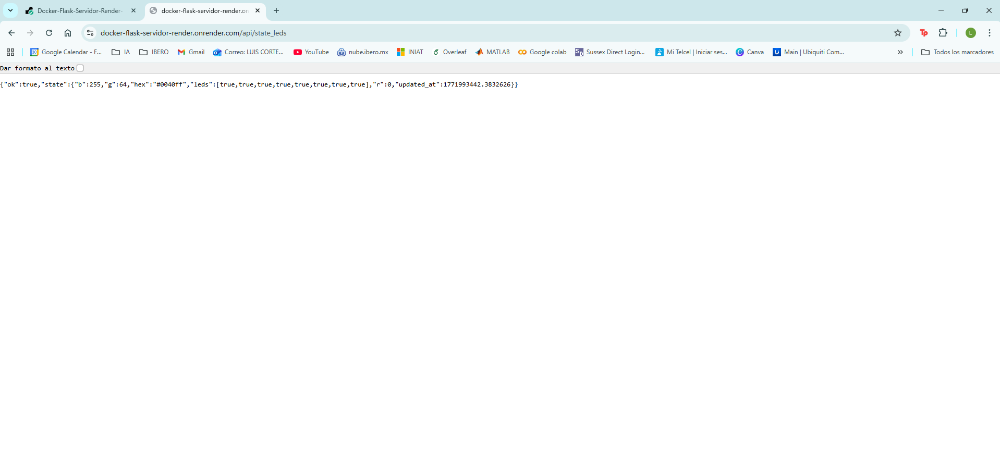

*Figura 12: Consulta del estado en Render mediante el endpoint /api/state_leds, mostrando el último color y el estado de los LEDs.*

Este video muestra los resultados obtenidos y evidencia cómo la tira de LEDs responde a los cambios realizados desde la página web, encendiéndose y modificando su color en tiempo real.

### Video
<video controls width="720">
  <source src="{{ '/assets/videos/videoRender.mp4' | relative_url }}" type="video/mp4">
  Tu navegador no soporta video HTML5.
</video>
