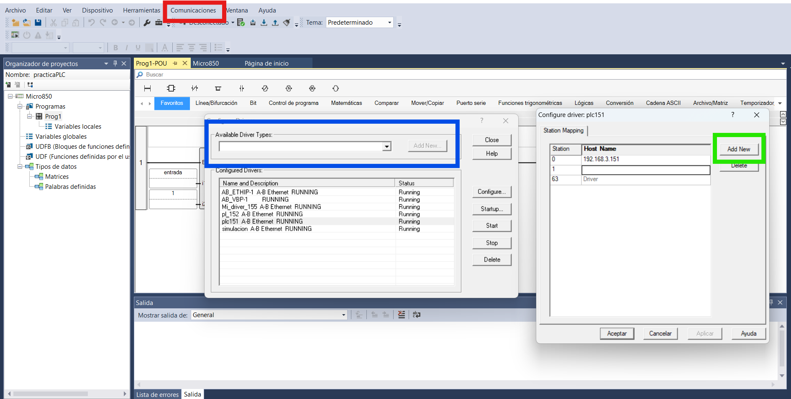
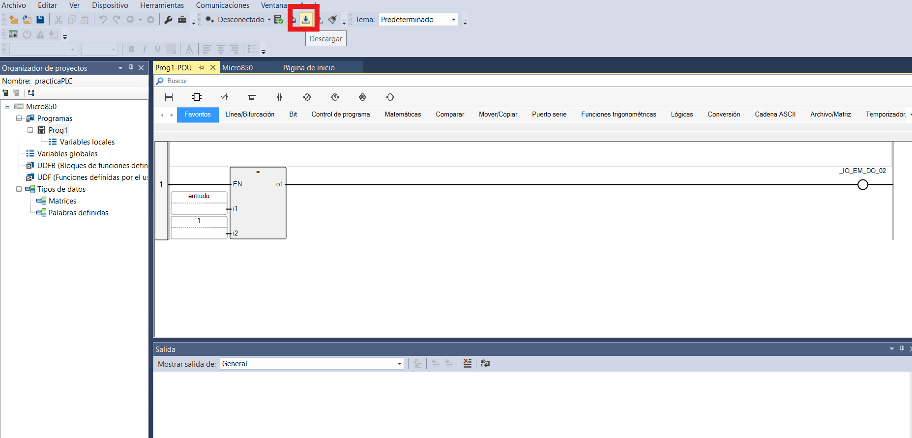
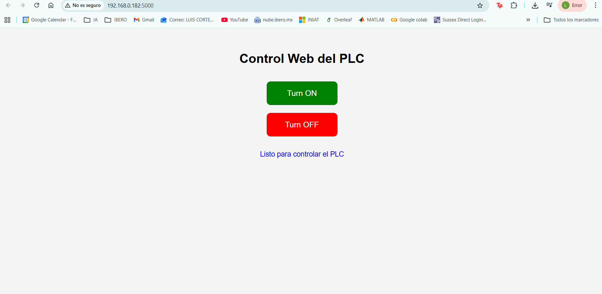

# Control de un PLC mediante una Interfaz Web en Python

A continuación, se presenta la práctica sobre la conexión de un PLC con una interfaz desarrollada en Python, integrando programación en Python y lenguaje escalera. Se muestra el procedimiento paso a paso para encender un LED del PLC mediante botones alojados en un servicio web desarrollado con Flask.

En esta práctica se utilizó un PLC Allen-Bradley Micro850-LC50-24QWB, versión 12.

## 1. Instalación de herramientas necesarias para la programación del PLC y la interfaz en Python

Primero, es necesario instalar las herramientas requeridas para el desarrollo de la práctica. En este caso, se debe contar con Visual Studio Code o cualquier otro entorno de desarrollo compatible con Python. Posteriormente, para programar el PLC, es necesario descargar e instalar el software Connected Components Workbench (CCW), el cual se utiliza para la programación del PLC Allen-Bradley. El enlace de la página oficial desde donde puede descargarse se muestra a continuación.

[https://www.rockwellautomation.com](https://www.rockwellautomation.com/es-mx/capabilities/industrial-automation-control/design-and-configuration-software.html)

## 2. Configuración inicial del PLC en Connected Components Workbench

Una vez instalado el software, se abre Connected Components Workbench (CCW), donde se mostrará la ventana inicial de configuración. En esta sección, se debe seleccionar el modelo de PLC con el que se está trabajando. Después de elegir la configuración correcta, se da clic en “Agregar al proyecto” como se muestra en la Figura 1. Con este paso, el PLC Allen-Bradley queda listo para comenzar su programación.


*Figura 1:* Ventana de selección y configuración inicial del PLC en CCW.

## 3. Configuración del mapeo Modbus y habilitación de Ethernet en el PLC

El siguiente paso consiste en configurar las variables de Modbus. Para ello, es necesario dirigirse a la configuración del Micro850 en el panel izquierdo, como se muestra en la Figura 2 dentro del recuadro rojo. Una vez ahí, se debe buscar la opción “Mapeado Modbus” y agregar la variable que se utilizará para enviar la señal desde el servicio web, tal como se indica en el recuadro azul de la Figura 2.


*Figura 2:* Configuración de variables en el mapeado Modbus del Micro850.

Posteriormente, en la configuración de Ethernet, se debe habilitar el mapeado Modbus, como se muestra en la Figura 3 dentro del recuadro rojo.


*Figura 3:* Habilitación del mapeado Modbus en la configuración Ethernet del PLC.

## 4. Creación del programa en lenguaje escalera para el control de una lámpara

Como tercer paso, se debe crear el programa en lenguaje escalera (Ladder Diagram). En este caso, se desarrolló un programa sencillo para accionar una lámpara del PLC mediante un botón ubicado en una interfaz web.

Primero, como se muestra en la Figura 4, se debe dar clic derecho en la opción “Programas”, después seleccionar “Agregar” y, por último, “Nuevo LD: Diagrama en escalera”. 


*Figura 4:* Creación de un nuevo programa Ladder en CCW.

Con esto, el software redireccionará a la pestaña mostrada en la Figura 5, donde se puede crear el programa que se desea implementar.

En esta práctica, se realizó una lógica simple en la que, cuando la variable de entrada —creada previamente en el mapeado Modbus— es igual a 1, se activa la salida 2, la cual está conectada a la lámpara en el panel de control.


*Figura 5:* Diseño del programa en lenguaje escalera para el control de la lámpara.

Finalmente, se muestra a continuación la carpeta que contiene el programa completo con toda la configuración descrita, para su descarga.

[Descargar programa escalera]({{site.baseurl }}/assets/files/practicaPLC.zip)

## 5. Configuración de la comunicación Ethernet para cargar el programa al PLC

1. Para cargar el programa al PLC, lo primero que se debe hacer es dar clic en la opción “Comunicaciones”, mostrada en la Figura 6 dentro del recuadro rojo, y posteriormente seleccionar “Configuración de controladores”.

2. Después, se abrirá la primera ventana mostrada en la Figura 6. En la parte señalada con el recuadro azul, se deben desplegar las opciones, seleccionar “Ethernet Devices” y después dar clic en “Add New”.

3. Una vez agregado el nuevo driver, se debe dar doble clic cuando aparezca en la sección de “Name” y “Description”. Esto desplegará la segunda ventana, en la cual se debe seleccionar “Add New”, opción marcada con el recuadro verde. 

4. Posteriormente, se debe escribir la dirección IP correspondiente al PLC y, finalmente, dar clic en “Aceptar” para después cerrar ambas ventanas.


*Figura 6:* Configuración del driver Ethernet y asignación de la dirección IP del PLC.

Finalmente, en la Figura 7 se muestra, dentro del recuadro rojo, el botón de descarga, sobre el cual se debe dar clic. Después, se deben seguir los pasos indicados por el software: primero seleccionar el driver recién creado y dar clic en “Aceptar”; posteriormente, elegir la opción “Descargar programa **al** controlador lógico”.

Si el programa en ladder está correctamente desarrollado, la descarga se realizará de manera exitosa en el PLC. Es importante llevar a cabo este procedimiento antes de crear y ejecutar el programa en Python.


*Figura 7:* Proceso de descarga del programa Ladder al PLC desde CCW.

## 6. Ejecución de la interfaz web para el control de la lámpara del PLC mediante pyhton

Finalmente, una vez que el PLC ha sido programado, desde la computadora conectada al PLC mediante Ethernet se debe ejecutar el programa main.py, mostrado a continuación.

### main.py

```python
# Step 1: Import libraries
from flask import Flask, request, render_template_string
from pymodbus.client import ModbusTcpClient

# Step 2: PLC configuration
PLC_IP = "192.168.3.152"
PLC_PORT = 502
REGISTER_ADDRESS = 0

# Step 3: Create Flask app
app = Flask(__name__)

# Step 4: Function to write to PLC
def write_value(val):
    client = ModbusTcpClient(PLC_IP, port=PLC_PORT)

    try:
        if client.connect():
            result = client.write_register(REGISTER_ADDRESS, val)

            if result.isError():
                return False, f"Error Modbus: {result}"

            return True, f"Registro escrito con valor {val}"
        else:
            return False, "No se pudo conectar al PLC"

    except Exception as e:
        return False, f"Excepción: {e}"

    finally:
        client.close()

# Step 5: Web page
HTML_PAGE = """
<!DOCTYPE html>
<html>
<head>
    <meta charset="utf-8">
    <title>PLC LED Control</title>
    <style>
        body {
            font-family: Arial, sans-serif;
            text-align: center;
            margin-top: 60px;
            background-color: #f4f4f4;
        }
        h1 {
            margin-bottom: 30px;
        }
        button {
            width: 180px;
            height: 60px;
            font-size: 20px;
            margin: 10px;
            border: none;
            border-radius: 10px;
            cursor: pointer;
        }
        .on {
            background-color: green;
            color: white;
        }
        .off {
            background-color: red;
            color: white;
        }
        .msg {
            margin-top: 25px;
            font-size: 18px;
            color: blue;
        }
    </style>
</head>
<body>
    <h1>Control Web del PLC</h1>

    <form action="/on" method="post">
        <button class="on" type="submit">Turn ON</button>
    </form>

    <form action="/off" method="post">
        <button class="off" type="submit">Turn OFF</button>
    </form>

    <div class="msg">{{ message }}</div>
</body>
</html>
"""

# Step 6: Main page
@app.route("/", methods=["GET"])
def home():
    return render_template_string(HTML_PAGE, message="Listo para controlar el PLC")

# Step 7: Route to turn ON
@app.route("/on", methods=["POST"])
def turn_on():
    ok, msg = write_value(1)
    return render_template_string(HTML_PAGE, message=msg)

# Step 8: Route to turn OFF
@app.route("/off", methods=["POST"])
def turn_off():
    ok, msg = write_value(0)
    return render_template_string(HTML_PAGE, message=msg)

# Step 9: Run server
if __name__ == "__main__":
    app.run(host="0.0.0.0", port=5000, debug=False)
```

Al hacerlo, se desplegará una interfaz como la presentada en la Figura 9.

Posteriormente, si otro dispositivo se conecta a la misma red y utiliza la URL mostrada en esa misma figura, podrá acceder al panel de control web. A través de esta interfaz, será posible encender y apagar la lámpara conectada al PLC.


*Figura 9:* Interfaz web para el control de encendido y apagado de la lámpara del PLC.

## 7. Resultados

A continuación, se presenta el video en el que se muestra el funcionamiento de la práctica:

<video controls width="720">
  <source src="{{ '/assets/videos/plcVideo.mp4' | relative_url }}" type="video/mp4">
  Tu navegador no soporta video HTML5.
</video>
